# 🦗 Cricket Acoustic Perception

> **วิทยานิพนธ์ปริญญาโท** — การวิเคราะห์และจัดกลุ่มเสียงจิ้งหรีดในฟาร์มเชิงพาณิชย์  
> โดยใช้ Unsupervised Learning เพื่อตรวจวัดพฤติกรรม (ความหิว, อัตราการรอดชีวิต)

## ภาพรวมโครงการ

ระบบนี้วิเคราะห์ **Soundscape ของฟาร์มจิ้งหรีด** (เสียงหลายตัวซ้อนทับกัน) โดยไม่ต้องแยกเสียงรายตัว  
ใช้ pipeline: **Raw Audio → Feature Extraction → UMAP → HDBSCAN → Behavior Alert**

```mermaid
flowchart TD
    subgraph Offline Phase ["1️⃣ Offline Training Phase (เทรนและตั้งค่าระบบ)"]
        A1["🎙️ ไฟล์เสียงตัวอย่างจากฟาร์ม/Dataset"] --> A2["audio_utils: Segment 5s & Denoise"]
        A2 --> A3["features: สกัด 53-dim Feature Vector"]
        A3 --> A4["clustering: UMAP + HDBSCAN"]
        A4 --> A5["notebook 05: จัดหมวดหมู่เสียงของแต่ละกลุ่มปุ่มเสียง\n- Calling Song / Aggressive / Quiet / Noise -"]
        A5 --> A6["classifier: เทรน SongTypeClassifier\n- SVM หรือ Random Forest -"]
        A6 --> A7["💾 Save: song_classifier.pkl"]

        A3 --> B1["notebook 06: วิเคราะห์สัญญาณเสียงบ่อปกติเพื่อหาเกณฑ์อ้างอิง\n- RMS / ACI Baseline -"]
        B1 --> B2["💾 Save: calibrated_thresholds.json"]
    end

    subgraph Online Phase ["2️⃣ Online Real-Time Phase (ตรวจจับและแจ้งเตือนเรียลไทม์)"]
        C1["🎙️ ไมโครโฟนสดในฟาร์ม หรือ ไฟล์เสียงยาวยี่สิบสี่ชั่วโมง"] --> C2["audio_utils: หั่นหน้าต่างเสียงทีละ 2.5s เลื่อนทุก 1.0s"]
        C2 --> C3["features: สกัด 53-dim Feature Vector\n- ~40-60ms -"]

        C3 --> C4["classifier: โหลด song_classifier.pkl เพื่อทำนายเสียง\n- <1ms -"]
        C4 --> C5{"ผลลัพธ์เสียงที่ทำนายได้"}

        C5 -->|Calling / Aggressive / Courtship| C6["behavior: BehaviorMonitor\n- โหลดค่าอ้างอิงจาก calibrated_thresholds.json\n- คำนวณปรับเกณฑ์กับอุณหภูมิปัจจุบัน -"]
        C5 -->|Quiet / Noise| C7["❌ ข้ามช่วงเวลานี้\n- ไม่แจ้งเตือนใดๆ -"]

        C6 --> C8["วิเคราะห์และประเมินผลลัพธ์"]
        C8 -->|Aggressive Song >= 35%| D1["⚠️ Hunger Alert\n- แจ้งเตือนความหิว -"]
        C8 -->|RMS หรือ ACI ต่ำกว่าปกติมากๆ| D2["🚨 Mortality Alert\n- แจ้งเตือนอัตราการตายสูง -"]
        C8 -->|สัญญาณเสียงเป็นปกติ| D3["✅ Normal\n- ฟาร์มอยู่ในสถานะปกติ -"]

        D1 & D2 --> E1(["📡 ส่งแจ้งเตือน\n- LINE Notify / MQTT / API -"])
    end

    style Offline Phase fill:#111122,stroke:#7c85ff,color:#fff
    style Online Phase fill:#112211,stroke:#69f0ae,color:#fff
```



## โครงสร้างโปรเจกต์

```
cricket_perception/
├── src/cricket_perception/
│   ├── audio_utils.py      # load, segment, denoise
│   ├── features.py         # MFCC, Spectral, RMS, ACI, FeatureExtractor
│   ├── clustering.py       # UMAP + HDBSCAN (GPU auto-detect via cuML)
│   ├── classifier.py       # SVM & RandomForest song-type classifier
│   ├── behavior.py         # Dolbear's Law, hunger alert, mortality alert
│   └── realtime.py         # Live mic and file streaming monitor
├── notebooks/
│   ├── 01_explore_dataset.ipynb    # ดู waveform, mel-spectrogram
│   ├── 02_feature_extraction.ipynb # สกัด features → บันทึก .npy
│   ├── 03_clustering.ipynb         # UMAP + HDBSCAN + scatter plot
│   ├── 04_behavior_analysis.ipynb   # จำลองการคำนวณ behavior alert
│   ├── 05_cluster_audio_labeling.ipynb # แปะป้ายจัดประเภทให้กลุ่มเสียง
│   ├── 06_baseline_calibration_protocol.ipynb # ตั้งค่าและ Calibrate บ่อ
│   └── 07_realtime_classifier.ipynb  # เทรนโมเดลและรัน Real-time demo
├── scripts/
│   ├── download_dataset.sh         # ดาวน์โหลด InsectSet32 จาก Zenodo
│   └── realtime_monitor.py         # สคริปต์สตรีมเสียงจริงจากไมค์
├── tests/
│   └── test_features.py            # Unit tests (21/21 passed)
├── requirements.txt
└── pyproject.toml
```

## เริ่มต้นใช้งาน

### 1. ติดตั้ง Environment

```bash
python3 -m venv .venv
source .venv/bin/activate
pip install -r requirements.txt
pip install -e .
```

### 2. ติดตั้ง PyTorch (GPU)

```bash
pip install torch torchaudio --index-url https://download.pytorch.org/whl/cu124
```

### 3. ดาวน์โหลด Dataset

```bash
./scripts/download_dataset.sh
```

ดาวน์โหลด **InsectSet32** (Orthoptera) จาก [Zenodo record 7072196](https://zenodo.org/records/7072196)  
— 9 species, 147 WAV files (CC BY 4.0)

### 4. รัน Notebooks

```bash
jupyter notebook notebooks/
```

| Notebook                           | เนื้อหา                                                                         |
| ---------------------------------- | ------------------------------------------------------------------------------- |
| `01_explore_dataset`               | ดู waveform, mel-spectrogram, species distribution                              |
| `02_feature_extraction`            | สกัด MFCC+Spectral+RMS+ACI → บันทึกเป็น `.npy`                                  |
| `03_clustering`                    | UMAP dimensionality reduction + HDBSCAN clustering                              |
| `04_behavior_analysis`             | จำลองการคำนวณพฤติกรรมและการแจ้งเตือน (Dolbear's Law, hunger, mortality)         |
| `05_cluster_audio_labeling`        | ฟังเสียงตัวอย่างและระบุความหมายเสียงให้กับแต่ละ Cluster                         |
| `06_baseline_calibration_protocol` | ตั้งค่าและคำนวณเกณฑ์ค่าพลังงานอ้างอิงปกติ (Baseline) ของบ่อจิ้งหรีดที่สุขภาพดี  |
| `07_realtime_classifier`           | เทรนโมเดลแยกแยะประเภทเสียง (SVM/RF) และรันระบบตรวจจับแจ้งเตือนแบบเรียลไทม์จำลอง |

### 5. รัน Tests

```bash
pytest tests/ -v
```

## Feature Pipeline

| Feature                                   | Dim    | บทบาท                               |
| ----------------------------------------- | ------ | ----------------------------------- |
| MFCC (13 coeff × mean+std)                | 26     | Timbre / texture ของเสียง           |
| Spectral (centroid, bw, rolloff, entropy) | 8      | ความแหลม/ทุ้ม, ความซับซ้อน          |
| Chroma + ZCR                              | 14     | Tonal content + chirp rate          |
| RMS Energy                                | 4      | ความดังโดยรวม (mortality indicator) |
| Acoustic Complexity Index (ACI)           | 1      | ความหลากหลายทางเสียง (biotic index) |
| **รวม**                                   | **53** |                                     |

## Behavior Analysis

| สัญญาณ          | วิธีตรวจ                         | เกณฑ์                    |
| --------------- | -------------------------------- | ------------------------ |
| **ความหิว**     | Aggressive Song cluster fraction | > 35% ของ soundscape     |
| **อัตราตาย**    | RMS + ACI เทียบกับ baseline      | < 40%/50% ของค่าปกติ     |
| **Temperature** | Dolbear's Law Q10 correction     | ปรับอัตโนมัติตามอุณหภูมิ |

## GPU Acceleration

ระบบ detect GPU อัตโนมัติ:

- **cuML (RAPIDS)** — GPU-accelerated UMAP + HDBSCAN (แนะนำ)
- **CPU fallback** — umap-learn + hdbscan (ทำงานได้เสมอ)

```bash
# ติดตั้ง cuML สำหรับ CUDA 12.x
pip install --extra-index-url=https://pypi.nvidia.com cuml-cu12==24.10.*
```

## Research Notes

ดูรายละเอียดหลักการทางวิทยาศาสตร์ใน [`research_notes.md`](research_notes.md)

## License

MIT License — สำหรับการวิจัยเชิงวิชาการ
