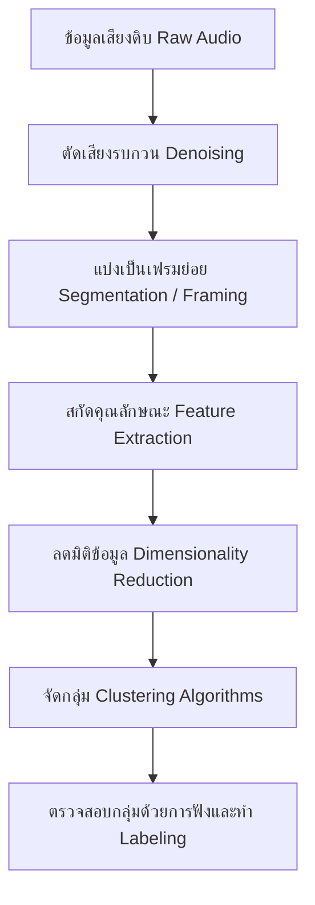

# คู่มือการวิเคราะห์และจัดกลุ่มเสียงจิ้งหรีด (Cricket Acoustic Perception Guide)

เอกสารฉบับนี้จัดทำขึ้นเพื่อแนะนำแนวทางและหลักการในการวิเคราะห์เสียงของจิ้งหรีดในฟาร์มเลี้ยง (จิ้งหรีดหลายตัวร่วมกัน) ทั้งในส่วนของการทำ **Clustering (การจัดกลุ่มแบบไม่มีผู้สอน - Unsupervised)** และ **Classification (การจำแนกพฤติกรรม - Supervised)** เพื่อตรวจวัดพฤติกรรม เช่น ความหิว หรืออัตราการรอดชีวิต (ตายหรือยัง)

---

## 1. ธรรมชาติของเสียงจิ้งหรีด (Cricket Stridulation)
จิ้งหรีดสร้างเสียงโดยการถูเปิด-ปิดปีกคู่หน้า (Stridulation) ซึ่งโดยปกติมี 3 พฤติกรรมหลัก:
1. **Calling Song (เสียงเรียกคู่):** เสียงดัง สม่ำเสมอ จังหวะคงที่ ใช้พลังงานปานกลาง เป็นเสียงที่เราได้ยินทั่วไปในฟาร์ม
2. **Courtship Song (เสียงเกี้ยวพาราสี):** เสียงเบา ความถี่สูง จังหวะรัว เร็ว เกิดขึ้นเมื่อตัวผู้พบตัวเมียระยะใกล้
3. **Aggressive Song (เสียงก้าวร้าว/แย่งอาณาเขต):** เสียงดัง ขาดช่วงเป็นระยะ และมีความถี่กระจัดกระจาย เกิดขึ้นเมื่อตัวผู้เผชิญหน้ากันหรือแย่งอาหาร

> [!IMPORTANT]
> **ความท้าทายในระบบเลี้ยงจริง (Multi-Cricket Context):**
> การฟังเสียงจิ้งหรีดจำนวนมากพร้อมกันในบ่อเลี้ยงจะไม่สามารถแยกแยะเสียงรายตัวได้ง่าย เสียงจะซ้อนทับกัน (Overlay) ดังนั้นหลักการวิเคราะห์จึงต้องมองเป็น **"ภาพรวมของเสียง (Soundscape)"** แทนการจำแนกตัวเดี่ยว ๆ

---

## 2. ขั้นตอนการทำ Clustering (จัดกลุ่มโดยไม่รู้ Class มาก่อน)
หากต้องการแยกประเภทของเสียงจิ้งหรีดในฟาร์มออกเป็นกลุ่ม ๆ (เช่น กลุ่มเสียงรบกวน, กลุ่มเสียงปกติ, กลุ่มเสียงผิดปกติ) โดยที่ยังไม่ต้องระบุชื่อพฤติกรรม ให้ทำตามขั้นตอนดังนี้:

### 2.1 Feature Extraction (การสกัดคุณลักษณะของเสียง)
เราต้องเปลี่ยนไฟล์เสียงให้อยู่ในรูปของตัวเลข (Feature Vectors) ที่คอมพิวเตอร์เข้าใจ:
*   **Mel-Frequency Cepstral Coefficients (MFCCs):** เป็นฟีเจอร์มาตรฐานที่ใช้ในการวิเคราะห์เสียงพูดและเสียงสัตว์ ช่วยจำลองลักษณะการรับรู้เสียงของหูสิ่งมีชีวิต
*   **Spectral Features:** 
    *   *Spectral Centroid:* วัดความแหลม/ทุ้มของเสียง (ช่วยแยกแยะระหว่าง Calling และ Courtship ได้ดี)
    *   *Spectral Complexity / Entropy:* วัดความซับซ้อนของเสียง
*   **Pre-trained Audio Embeddings (แนะนำสำหรับยุคใหม่):**
    *   ใช้โมเดลโครงข่ายประสาทเทียมที่เทรนมาแล้ว เช่น **YAMNet** หรือ **VGGish** (ของ Google) ในการแปลงเสียงช่วงเวลาสั้น ๆ ให้กลายเป็นเวกเตอร์ขนาด 1024 หรือ 512 มิติ ซึ่งโมเดลเหล่านี้มีความเข้าใจในโครงสร้างเสียงสูงมาก แม้เสียงจะปนเปกัน

### 2.2 Dimensionality Reduction (การลดมิติข้อมูลเพื่อดูโครงสร้าง)
เนื่องจากฟีเจอร์ที่สกัดได้จะมีมิติตั้งแต่ 13 ถึง 1024 มิติ การจับกลุ่มและการพล็อตดูด้วยตาสามัญจะทำได้ยาก แนะนำให้ใช้:
*   **UMAP (Uniform Manifold Approximation and Projection):** รักษาระยะห่างและความเป็นกลุ่มก้อนของข้อมูลเสียงได้ดีที่สุดในปัจจุบัน
*   **t-SNE:** ทางเลือกที่ดีในการกระจายข้อมูลเพื่อหาคลัสเตอร์ย่อย ๆ

### 2.3 Clustering Algorithms (อัลกอริทึมจัดกลุ่ม)
*   **HDBSCAN (Hierarchical Density-Based Spatial Clustering):** ดีที่สุดสำหรับงานเสียงชีวภาพ (Bioacoustics) เพราะ:
    1. ไม่ต้องกำหนดจำนวนกลุ่ม (K) ล่วงหน้า
    2. สามารถคัดแยกเสียงรบกวน (Noise/Outliers) ที่ไม่เกี่ยวข้องออกไปได้โดยอัตโนมัติ
*   **K-Means:** ใช้ง่ายแต่มีข้อเสียคือต้องระบุจำนวนกลุ่มล่วงหน้า และอ่อนไหวต่อเสียงรบกวน

---

## 3. การประยุกต์ใช้เพื่อจำแนกพฤติกรรม (Classification)
เมื่อทำการจัดกลุ่ม (Clustering) แล้วและได้กลุ่มที่เสถียร เราจะสุ่มนำเสียงในกลุ่มเหล่านั้นไปให้ผู้เชี่ยวชาญหรือคนเลี้ยงฟังเพื่อติดป้ายกำกับ (Label) เช่น "กลุ่มนี้คือเสียงแย่งอาหาร", "กลุ่มนี้คือเสียงพัดลมระบายอากาศ" จากนั้นจึงสร้างโมเดลจำแนกพฤติกรรม (Classification):

### 3.1 การวิเคราะห์พฤติกรรมในฟาร์มจิ้งหรีด
1.  **ดูว่าจิ้งหรีด "หิว" หรือยัง?**
    *   **ทฤษฎี:** เมื่ออาหารขาดแคลนหรือจำกัด จิ้งหรีดจะแย่งอาหารกัน ส่งผลให้เกิด **Aggressive Song** สูงขึ้นอย่างเห็นได้ชัด
    *   **การตรวจวัด:** ตรวจหาอัตราส่วนของเสียง Aggressive ต่อเสียง Calling หากมีเสียง Aggressive สูงเกินเกณฑ์ (Threshold) ระบบจะแจ้งเตือนว่าควรให้อาหารได้แล้ว
2.  **ดูว่าจิ้งหรีด "ตาย" หรือมีอัตรารอดต่ำหรือไม่?**
    *   **ทฤษฎี:** บ่อที่มีจิ้งหรีดตายจำนวนมาก หรือจิ้งหรีดไม่แข็งแรง จะมีระดับกิจกรรม (Acoustic Activity) ต่ำลงอย่างมาก
    *   **การตรวจวัด:** วัด **Root Mean Square (RMS) Energy** (ความดังภาพรวม) ร่วมกับ **Acoustic Complexity Index (ACI)** ซึ่งเป็นดัชนีวัดความซับซ้อนทางเสียง หากดัชนีเหล่านี้ลดลงต่ำกว่าระดับปกติที่สัมพันธ์กับอุณหภูมิ แสดงว่าจิ้งหรีดอาจตายหรือเกิดโรคระบาด
3.  **การควบคุมปัจจัยภายนอก (อุณหภูมิ):**
    *   *Dolbear's Law:* ความเร็วในการร้องของจิ้งหรีดแปรผันตรงกับอุณหภูมิ ดังนั้นระบบตรวจวัดจะต้องนำอุณหภูมิของบ่อเลี้ยงเข้ามาคำนวณร่วมด้วย เพื่อป้องกันการวิเคราะห์ผิดพลาด (เช่น อากาศหนาวจิ้งหรีดร้องช้า ไม่ใช่เพราะป่วยหรือหิว)

---

## 4. แนะนำ Stack เทคโนโลยีสำหรับการพัฒนา
หากเริ่มทำโปรเจกต์นี้ในโฟลเดอร์ `cricket_perception` แนะนำให้ติดตั้งเครื่องมือเหล่านี้ใน Python:

*   **Librosa:** คลังข้อมูลสำหรับสกัดฟีเจอร์เสียง (MFCCs, Spectral features)
*   **Scikit-learn:** สำหรับทำ K-Means, PCA, และโมเดลจำแนกแบบดั้งเดิม
*   **UMAP-learn:** สำหรับจัดเรียงเวกเตอร์ลงใน 2D/3D space
*   **HDBSCAN:** สำหรับการคลัสเตอร์แบบไม่กำหนดจำนวนกลุ่ม
*   **TensorFlow / PyTorch:** หากต้องการใช้ YAMNet/VGGish สำหรับ Audio Embeddings หรือใช้ CNNs ในการวิเคราะห์ Mel-Spectrogram (มองเสียงเป็นรูปภาพแล้วใช้ Image Classification)

---

> [!TIP]
> **ขั้นตอนการเริ่มต้นที่ง่ายที่สุด:**
> 1. บันทึกเสียงจิ้งหรีดจากบ่อเลี้ยงในช่วงเวลาที่ต่างกัน (หลังให้อาหารใหม่ ๆ, ก่อนให้อาหารตอนที่น่าจะหิว, ช่วงที่อากาศเย็น/ร้อน) ช่วงละ 5-10 นาที
> 2. นำเสียงมาตัดแบ่งเป็นท่อนละ 5 วินาที
> 3. ใช้ Librosa ดึงค่า MFCCs ของแต่ละท่อน
> 4. ใช้ UMAP ลดมิติเหลือ 2 มิติ แล้วทำ Scatter plot ดูว่าข้อมูลแยกตัวกันเป็นกลุ่มหรือไม่
